|  |  |             |  |
|-----------------------------------------------------------------------------------------------------------------|---------------------------------------------------------------------------------------------------------------------------|--------------------------------------------------------------------------------------------------------------------------|---------------------------------------------------------------------------------------------------------------|
|                                                                                                                 |                                                                                                                           |  |                                                                                                               |

## Table des matières

- [Table des matières](#table-des-matières)
- [1. Introduction](#1-introduction)
- [2. Installation](#2-installation)
- [3. Utilisation](#3-utilisation)
    - [3.1 Se connecter](#31-se-connecter)
    - [3.2 Acheter des graines](#32-acheter-des-graines)
    - [3.3 Planter une graine](#33-planter-une-graine)
    - [3.4 Améliorer une graine](#34-améliorer-une-graine)
    - [3.5 Consulter sa forêt](#35-consulter-sa-forêt)
    - [3.6 Envoyer/Accepter des demandes d'amis](#36-envoyeraccepter-des-demandes-damis)
    - [3.7 Visiter la forêt d'un amis](#37-visiter-la-forêt-des-amis)
    - [3.8 Paramètres](#38-paramètres)
- [4. Développement](#4-développement)
    - [4.1 Architecture](#41-architecture)
    - [4.2 Technologies](#42-technologies)
    - [4.3 Modèle de données](#43-modèle-de-données)
    - [4.4 Maquettes](#44-maquettes)
- [5. Auteurs](#5-auteurs)

## 1. Introduction

Garden-Pomodoro est une application mobile pour Android et iOS qui vous permet de suivre votre temps
de travail et de vous concentrer plus efficacement. En utilisant un système de pomodoro, vous
pourrez suivre votre temps et le gérer de manière ludique et efficace.

Vous pouvez acheter des graines et les planter pour faire pousser des arbres qui vous
donneront des récompenses. Vous pouvez améliorer vos arbres et les consulter dans votre forêt
personnelle. Vous pouvez également envoyer et accepter des demandes d'amis pour visiter leurs
forêts.

## 2. Installation

Pour installer l'application, vous devez avoir Flutter installé sur votre ordinateur. Vous pouvez
suivre les instructions sur le site officiel de Flutter pour installer Flutter sur votre ordinateur.

Une fois que vous avez installé Flutter, vous pouvez cloner le projet et lancer l'application sur
votre téléphone ou sur un émulateur.

Vous pouvez également télécharger l'installateur depuis la page
de [release](https://github.com/jardin-pomodoro/dino-pomodoro/releases) du projet.

## 3. Utilisation

### 3.1 Se connecter

Lorsque vous lancez l'application pour la première fois, vous devez vous connecter à votre compte. Vous pouvez soit vous
créer un compte, soit vous connecter à un compte existant.

Vous pouvez vous identifier plus facilement avec votre compte :

- Google
- Discord
- Github

Vous pouvez également vous connecter avec votre adresse email et votre mot de passe.

| 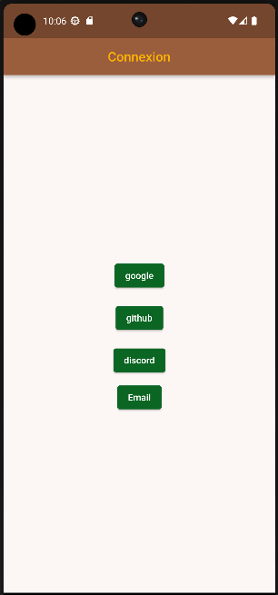 | 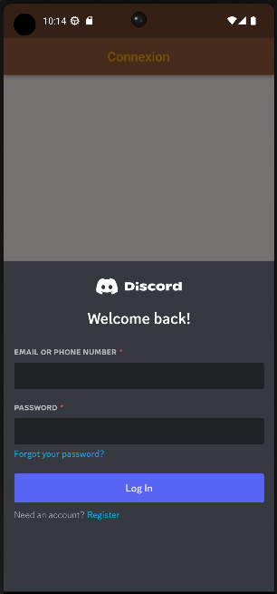 | 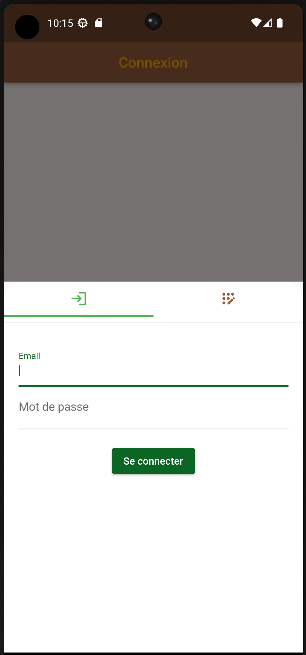 |
|-------------------------------------------------------------------------------|-------------------------------------------------------------------------------|-------------------------------------------------------------------------------|

### 3.2 Acheter des graines

Vous pouvez acheter des graines dans la boutique. Ces graines vous permettrons de planter des arbres dans votre forêt.
Chaque graine possède un temps de croissance et une récompense de base.

Vous pouvez améliorer vos graines pour les rendre plus efficaces. Améliorer le feuillage d'une graine vous permettra d'
augmenter la récompense de base de cette graine. Améliorer son tronc vous permettra de réduire le temps de croissance de
cette graine. Une graine possède un niveau maximum d'amélioration.

| 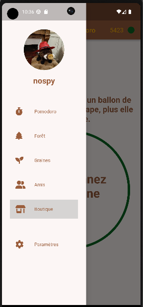 | 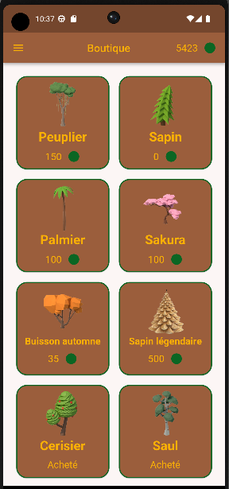 | 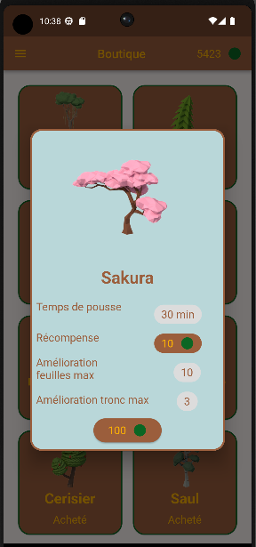 |
|-------------------------------------------------------------------------------|-------------------------------------------------------------------------------|-------------------------------------------------------------------------------|

### 3.3 Planter une graine

Vous pouvez planter une graine dans votre forêt. Pour cela, vous devez posseder au moins une graine afin de pouvoir la
choisir. Vous pouvez planter une graine en cliquant sur le bouton `Planter` dans la forêt.

Il faut ensuite attendre que l'arbre pousse, SANS QUIETER L'APPLICATION. Vous pouvez verrouiller votre téléphone, mais
si
vous quittez l'application avant la fin de la croissance, l'arbre mourra et vous ne garderez pas la récompense.

|  |  | 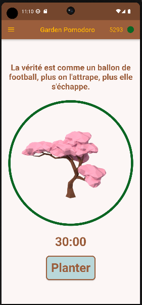 |
|-------------------------------------------------------------------------------|-------------------------------------------------------------------------------|-------------------------------------------------------------------------------|
| 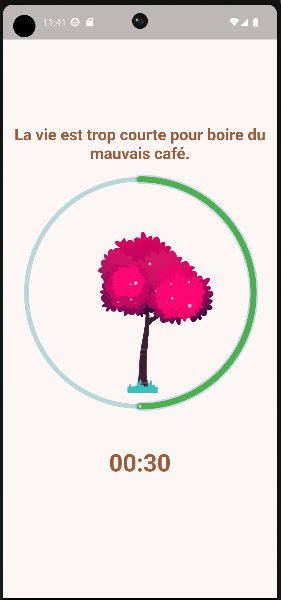 | 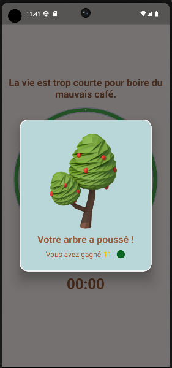 |  |

### 3.4 Améliorer une graine

Lorsque vous consultez une graine, vous pouvez améliorer le feuillage et le tronc de cette graine. Vous pouvez améliorer
le feuillage et le tronc de la graine jusqu'au niveau maximum déterminé par la graine.

- Améliorer le feuillage vous permettra d'augmenter la récompense de base de la graine.
- Améliorer le tronc vous permettra de réduire le temps de croissance de la graine.

| 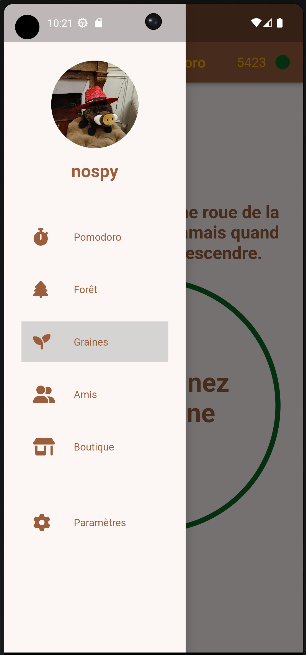 | 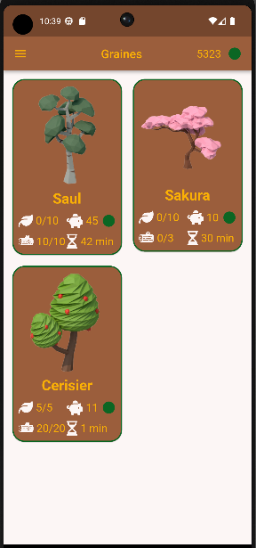 | 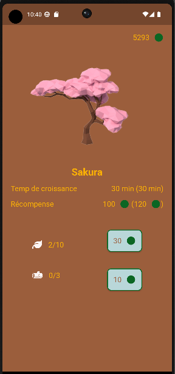 |
|-------------------------------------------------------------------------------|-------------------------------------------------------------------------------|-------------------------------------------------------------------------------|

### 3.5 Consulter sa forêt

Vous pouvez consulter votre forêt en cliquant sur le bouton `Forêt` dans le menu. Vous pouvez voir les arbres que vous
avez plantés. Cela vous permettra de voir le temps que vous avez passé à planter des arbres et donc à rester concentré.

Vous pouvez consulter votre forêt par jour, semaine, mois ou année.

| 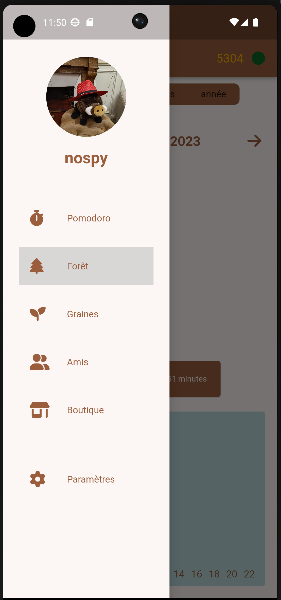 | 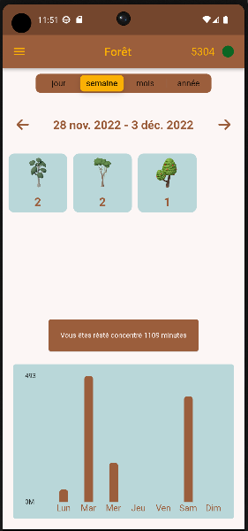 | 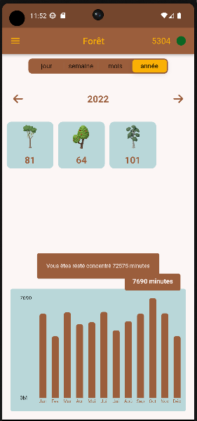 |
|-------------------------------------------------------------------------------|-------------------------------------------------------------------------------|-------------------------------------------------------------------------------|

### 3.6 Envoyer/Accepter des demandes d'amis

Que serait une application de pomodoro sans amis ? Vous pouvez envoyer des demandes d'amis à vos amis. Vous pouvez
accepter ou refuser les demandes d'amis que vous recevez.

Cela vous permettra de savoir si vous collè... amis restent concentrés.

| 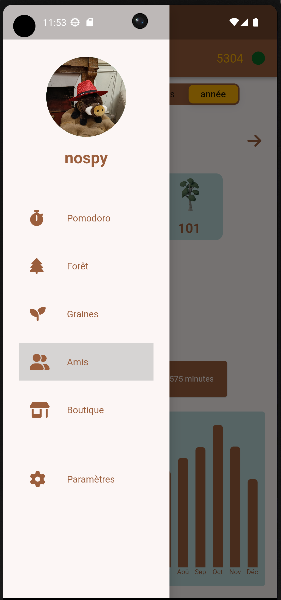 | 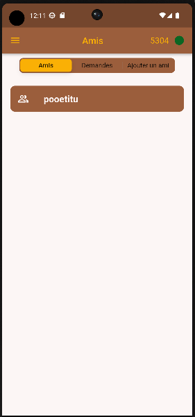 | 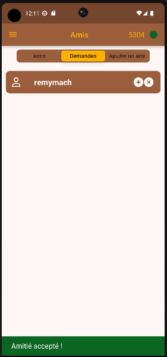 | 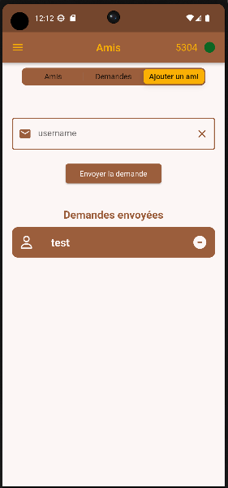 |
|-------------------------------------------------------------------------------|-------------------------------------------------------------------------------|-------------------------------------------------------------------------------|-------------------------------------------------------------------------------|

### 3.7 Visiter la forêt des amis

Vous pouvez visiter la forêt des amis en cliquant sur ce dernier pour voir sa forêt.

| 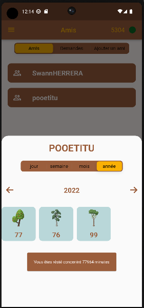 | 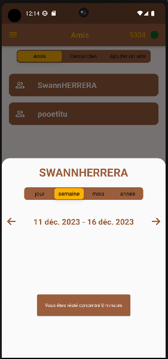 |
|-------------------------------------------------------------------------------|-------------------------------------------------------------------------------|

### 3.8 Paramètres

Vous pouvez modifier vos paramètres en cliquant sur le bouton `Paramètres` dans le menu. Vous pouvez modifier votre
nom d'utilisateur, votre email et votre avatar.

Vous pouvez aussi vous déconnecter de l'application.

| 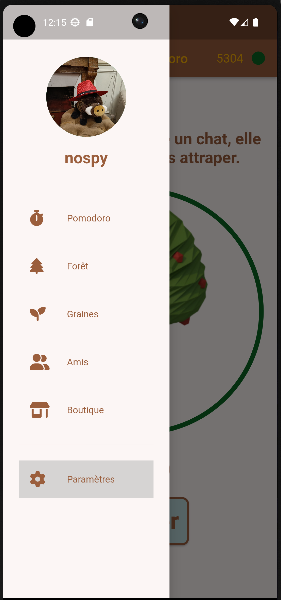 | 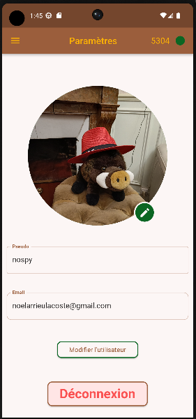 |
|-------------------------------------------------------------------------------|-------------------------------------------------------------------------------|

## 4. Développement

### 4.1 Architecture

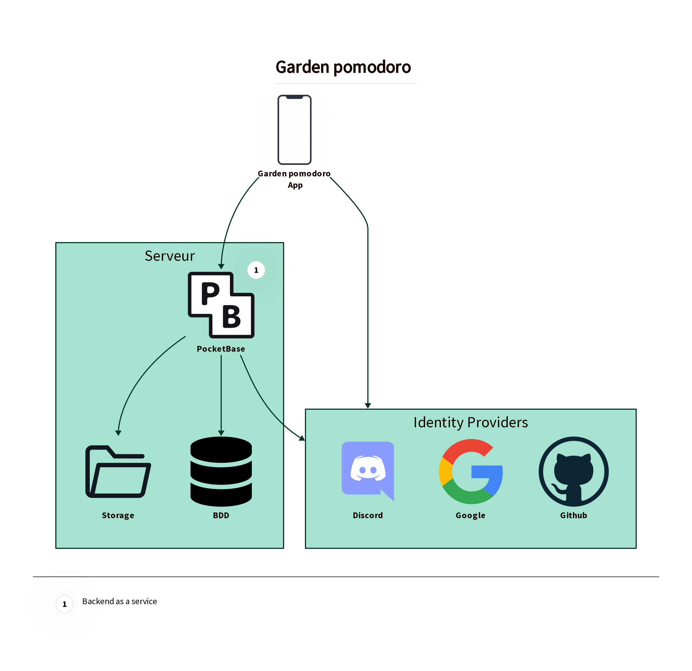

### 4.2 Technologies

| Nom                                                                   | Version  | Description                                                                                                                                       |
|-----------------------------------------------------------------------|----------|---------------------------------------------------------------------------------------------------------------------------------------------------|
| [Pocketbase](https://pocketbase.io/)                                  | 0.12.2   | Solution backend (As a service) opensource en Go                                                                                                  |
| [Flutter](https://flutter.dev/)                                       | 3.7.1    | Kit de développement d'interface utilisateur open-source pour la création d'applications mobiles                                                  |
| [Dart](https://dart.dev/)                                             | 2.19.1   | Langage de programmation open-source pour la création d'applications web et mobiles. Il est utilisé pour le développement d'applications Flutter. |
| [sqflite](https://pub.dev/packages/sqflite)                           | ^2.1.0+1 | Librairie flutter pour manipuler une base de données locale                                                                                       |
| [flutter_riverpod](https://pub.dev/packages/flutter_riverpod)         | 2.0.2    | Librairie flutter de gestion d'état                                                                                                               |
| [oauth2](https://pub.dev/packages/oauth2)                             | ^2.0.1   | Librairie flutter pour l'authentification Oauth2                                                                                                  |
| [webview_flutter](https://pub.dev/packages/webview_flutter)           | ^4.0.2   | Librairie flutter pour afficher des fenêtres web                                                                                                  |
| [font_awesome_flutter](https://pub.dev/packages/font_awesome_flutter) | ^10.3.0  | Librairie flutter de pack d'icônes                                                                                                                |
| [go_router]()                                                         |          | Librairie flutter pour la navigation / le routing                                                                                                 |
| [image_picker]()                                                      |          | Librairie flutter                                                                                                                                 |
| [fl_chart]()                                                          |          | Librairie flutter                                                                                                                                 |

### 4.3 Modèle de données

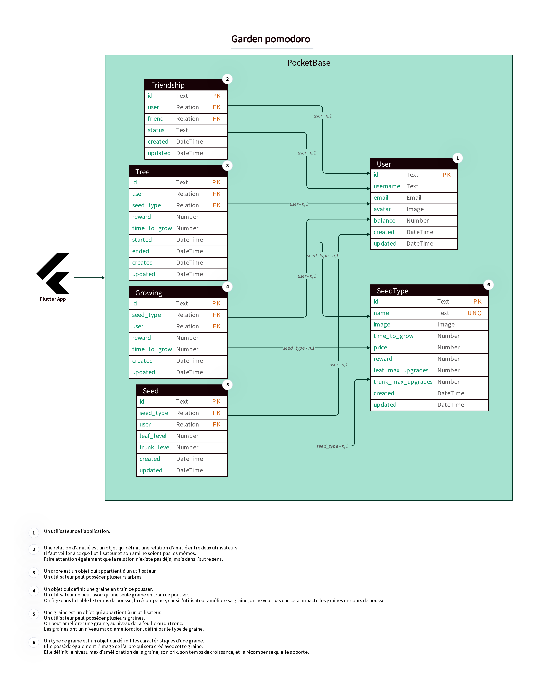

### 4.4 Maquettes

## 5. Auteurs

